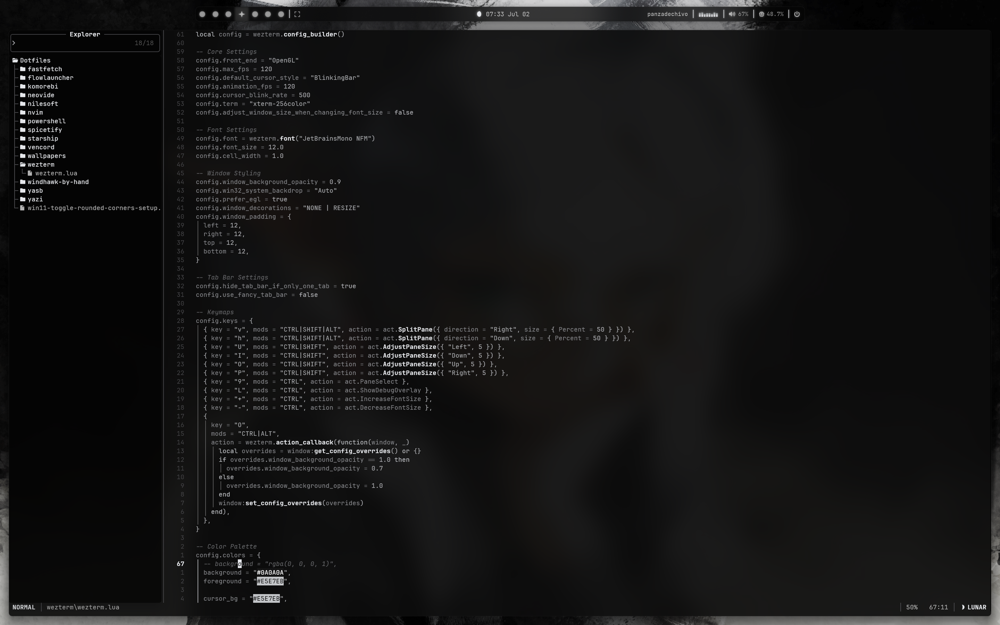
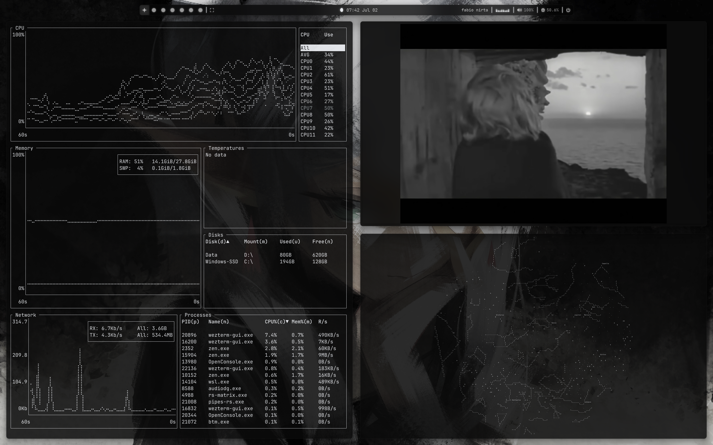
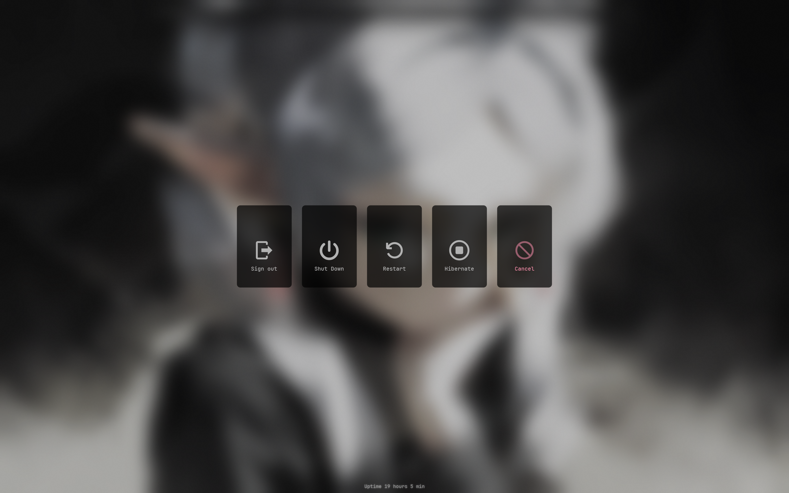

# 🌕 Luna Obscura rice 
Luna Obscura - A desaturated, dark monochrome Windows 11 rice
## 📸 Gallery

---

---

---

---

---

---

---

## 🛠️ System Components

| Component | Software Used | Description 
| --- | --- | --- |
| **Window Manager** | Komorebi | Tiling window management layer for Windows. |
| **Terminal** | WezTerm | Fully configurable, GPU-accelerated terminal emulator. |
| **Text Editor** | Neovim / Neovide | Lightweight, extensible modal text editor. |
| **File Manager** | Yazi | Fast, asynchronous terminal file manager. |
| **Status Bar** | YASB | Customizable status bar driven by custom stylesheet layouts. |

---
